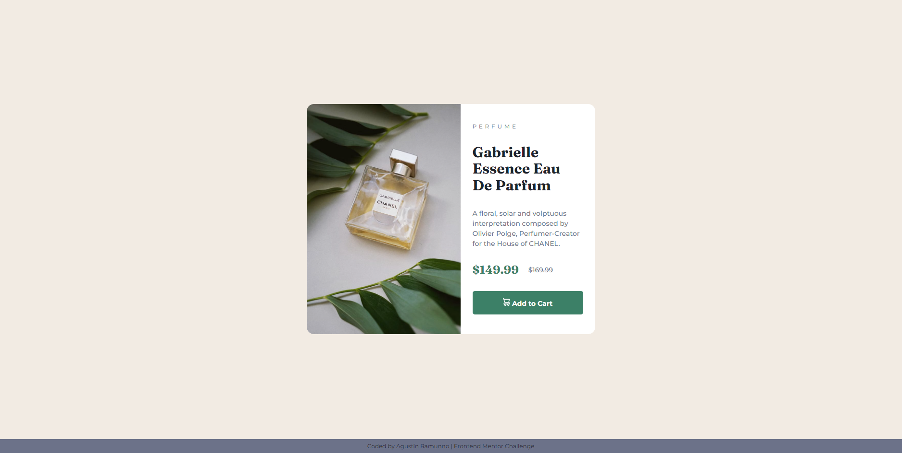

# Frontend Mentor - Product card component Solution

This is a solution to the [Product preview card component challenge on Frontend Mentor](https://www.frontendmentor.io/challenges/product-preview-card-component-GO7UmttRfa). Frontend Mentor challenges help you improve your coding skills by building realistic projects.

## Table of contents

- [Overview](#overview)
  - [The challenge](#the-challenge)
  - [Screenshot](#screenshot)
  - [Links](#links)
- [My process](#my-process)
  - [Built With](#built-with)
  - [Useful resources](#useful-resources)
- [Author](#author)

## Overview

### The challenge

Users should be able to:

- View the optimal layout depending on their device's screen size
- See hover and focus states for interactive elements

### Screenshot

### Links

- Solution URL: [GitHub Link](https://github.com/RamunnoAJ/product-card)
- Live Site URL: [Site Link](https://ramunnoaj.github.io/product-card/)

## My Process

### Built with

- Semantic HTML5 markup
- CSS custom properties
- Flexbox
- Mobile-first workflow

### Useful resources

- [First resource](https://www.youtube.com/watch?v=u044iM9xsWU) - This video helped me a lot to truly understand how to interact with flexbox and his properties. I'd recommend it to anyone still learning this concept.

## Author

- Website - [Agustín Ramunno](https://ramunnoaj.github.io/my-portfolio/)
- GitHub - [@RamunnoAJ](https://github.com/RamunnoAJ)
- Frontend Mentor - [@RamunnoAJ](https://www.frontendmentor.io/profile/RamunnoAJ)
